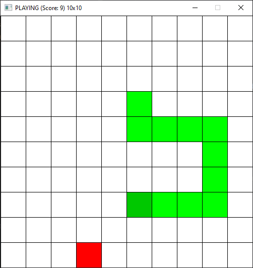

# Snake Game

A simple and classic version of the snake game written in C using the SDL2 library.



# Controls

**WASD/Arrows** - Move around

**-/+** - Change grid size

**R** - Restart

# Build

1. Install Conan:

   `pip install conan`

2. Detect default profile:

   `conan profile detect --force`

3. Generate required files:

   `conan install . --build=missing`

4. Build:

   ```
   cd build
   cmake .. -DCMAKE_TOOLCHAIN_FILE=Release/generators/conan_toolchain.cmake -DCMAKE_BUILD_TYPE=Release
   cmake --build .
   ```